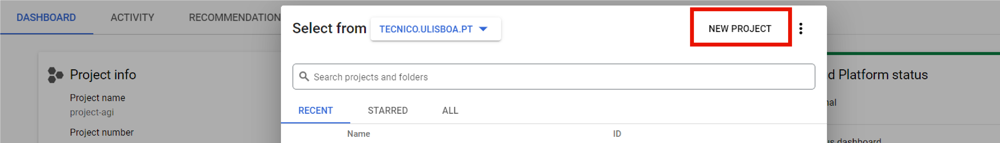
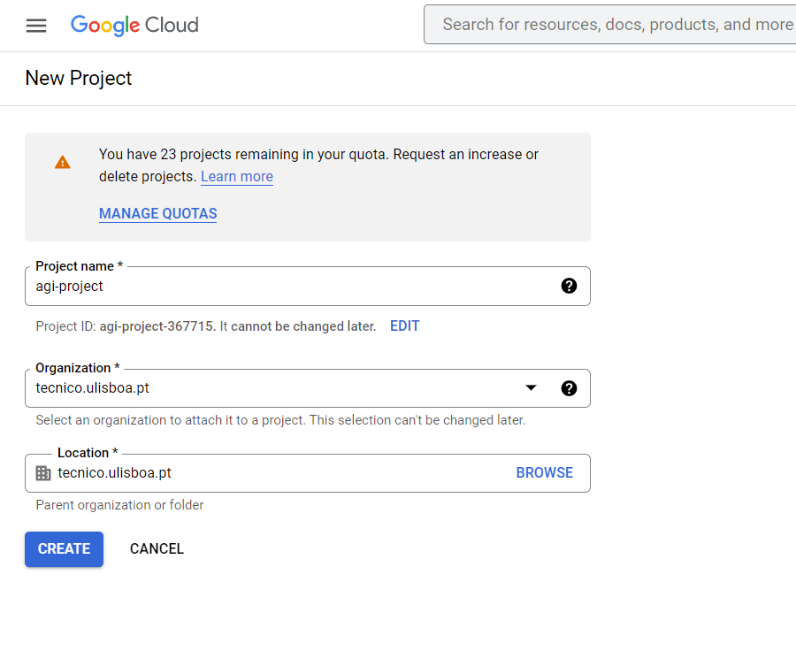
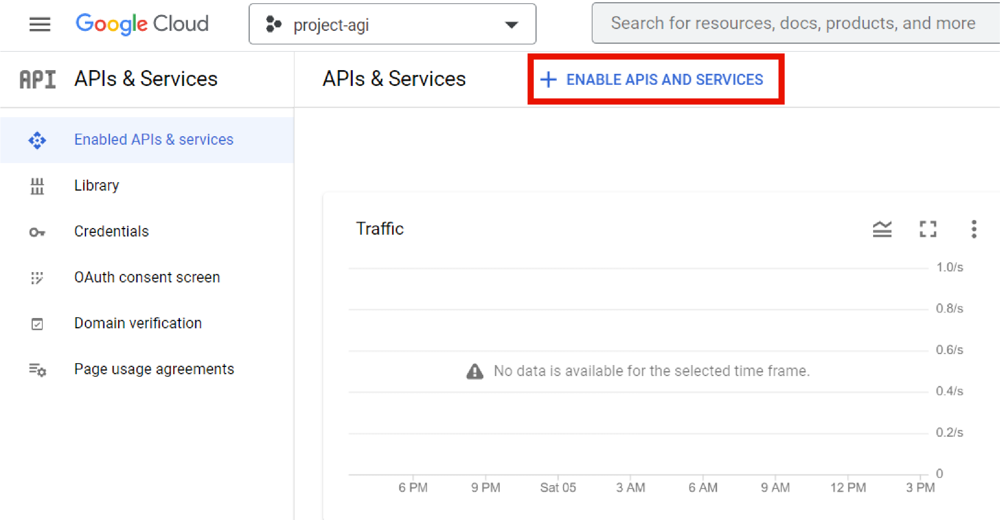
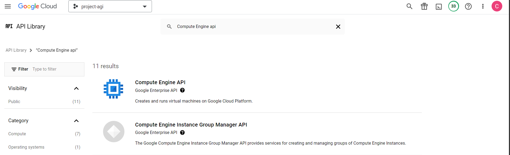
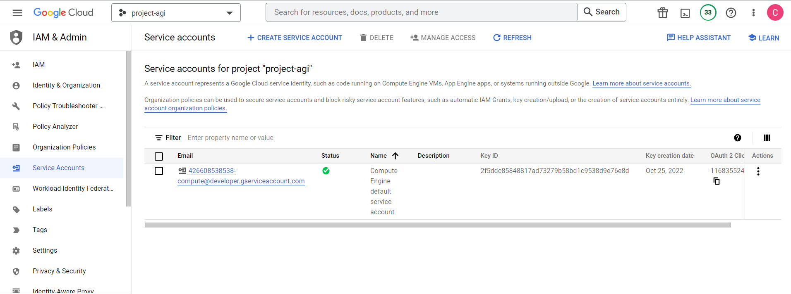
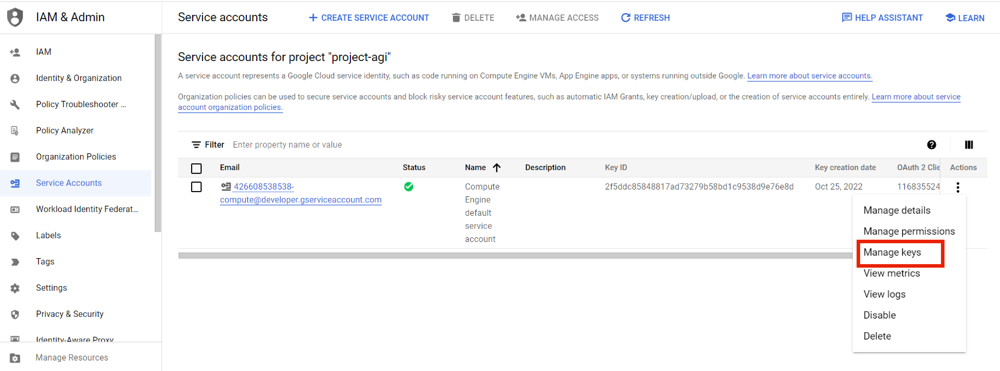
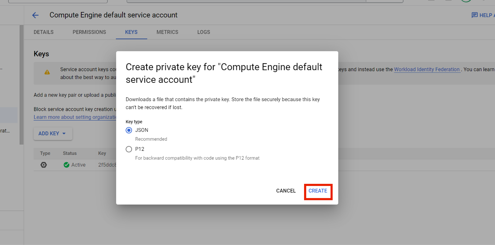
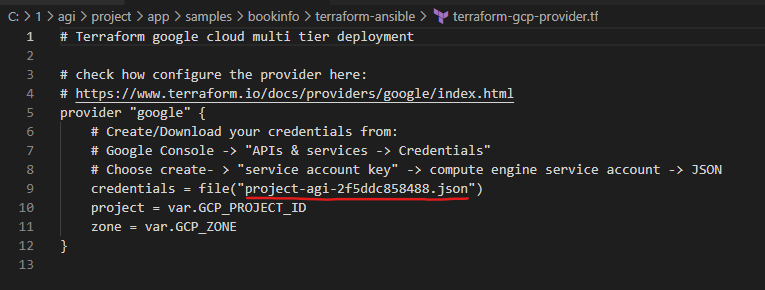
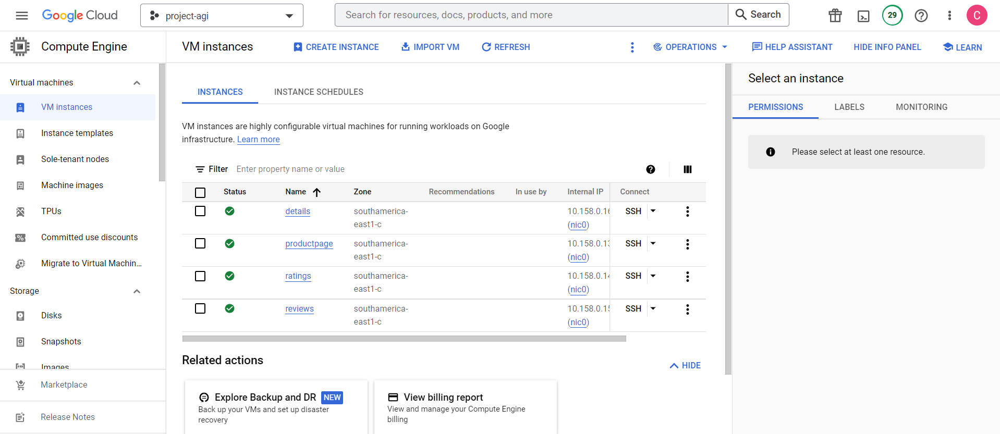

# BOOKINFO 

See: https://istio.io/latest/docs/examples/bookinfo/

When fully deployed, the application displays information about a book, similar to a single catalog entry of an online book store. Displayed on the page is a description of the book, book details (ISBN, number of pages, and so on), and a few book reviews.

# Build Vagrant Environment that hosts the management node

1- In the local repository, run the Vagrantfile and access the management node. In our solution, we used the Virtual Box to host the management node. 

```bash
$ vagrant validate

$ vagrant up
```

2- Access the management node via *ssh*

```bash
$ vagrant ssh mgmt
```

The next bash steps will **ALL** be done inside the *mgmt node*.

# Configure Terraform and the public Cloud Platform

The public Cloud Platform chosen to deploy the application was Google Cloud Platform (gcp). 

## 1. Set-up Google Cloud Platform

1- Open the following URL https://console.cloud.google.com/education (hopefully the user already has a functional account with a working CUPON code; otherwise, Lab4 explains in detail how to create the account and introduce the CUPON.)

2- Create the Project. 
   Select on the top Menu Bar the Organization/Projects drop down button, that will open a window for selecting and/or creating a Project, as illustrated in the following figure:




3- Select NEW PROJECT and give the following name: **agi-project**. 




The system will then take some time (a minute or more) to create the Project. When complete, you will enter the
Project Console (Dashboard).


4- Now it's time to generate the Google Cloud credentials. For this, in the Google Cloud Console choose API & Services-> Enabled APIs and Services. There, you can see a button on top of the menu enabling APIS AND SERVICES, as following:



5- Selecting that button opens a new window for selecting the type of API (as in the following Figure). In thatwindow search for **Compute Engine api**, select it and then click ENABLE.



6- When the API is enabled you can then, in the Google Cloud Console menu, choose IAMand Admin->Service Accounts. There, you see that a Service Account for the Compute Engine default service account is created, as shown:



7- In the column Actions, select Manage keys, that opens a new window and select Create new key:



8- After selecting Create new key, a pop-up window opens. Select the JSON checkbox which will download to your computer a Credentials file.




9- Save the file in the project/app/samples/bookinfo/terraform-ansible folder. There, edit the file *terraform-gcp-provider.tf* line 9 to have the correct name of the JSON credential file you downloaded.



## 2. Create the application's infrastructure in GCP using Terraform

```bash
$ cd project/app/samples/bookinfo/terraform-ansible/

$ ssh-keygen -t rsa -b 4096

$ terraform init

$ terraform plan

$ terraform apply
```

After running the terraform instructions, the IPs of the four instances created are outputted. You can also confirm that the instances were correctly created by going to the Google Cloud Console menu -> Compute Engine -> Vm instances, and you will see the following page: 



# Configure the GCP Instances with Ansible

1- In order for Ansible to access the machines and configure them, there is the need to populate the INVENTORY file, in this case named *gcphosts* , with the IP addresses(retrieved from the output of 'terraform apply').

2- Run the *playbook.yml* file to deploy and run each service

```bash
$ ansible-playbook playbook.yml

```

# Test the application by hitting productpage in the browser.

```bash
$ http://ip-of-product-page:9080

```